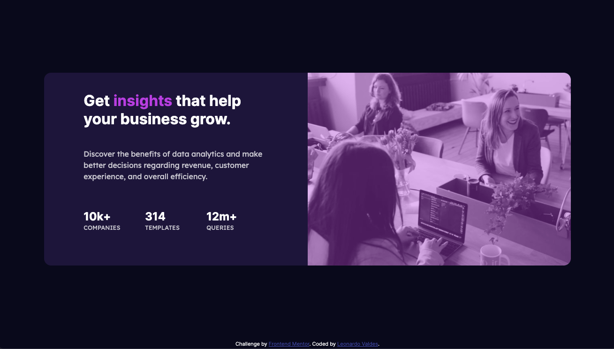

# Frontend Mentor - Stats preview card component solution

This is a solution to the [Stats preview card component challenge on Frontend Mentor](https://www.frontendmentor.io/challenges/stats-preview-card-component-8JqbgoU62). Frontend Mentor challenges help you improve your coding skills by building realistic projects.

## Table of contents

- [Overview](#overview)
  - [The challenge](#the-challenge)
  - [Screenshot](#screenshot)
  - [Links](#links)
- [My process](#my-process)
  - [Built with](#built-with)
  - [What I learned](#what-i-learned)
  - [Useful resources](#useful-resources)
- [Author](#author)
- [Acknowledgments](#acknowledgments)

**Note: Delete this note and update the table of contents based on what sections you keep.**

## Overview

### The challenge

Users should be able to:

- View the optimal layout depending on their device's screen size

### Screenshot

### Links

- Live Site URL: [Netlify](https://nostalgic-kepler-8d16c4.netlify.app)

## My process

### Built with

- Semantic HTML5 markup
- CSS custom properties
- Sass
- Flexbox
- Mobile-first workflow

### What I learned

Overall, I learned to use flexbox a little better, though I can get better with more practice.

I also learned its easier to start with mobile first layouts and then use media queries to lay out desktop designs.

### Useful resources

- [CSS Image overlays](https://www.youtube.com/watch?v=SXQ9l0ScDEA&t=315s) - This helped me with adding a purple overlay for the image. It's a good video to show how overlays can make a site look much better.

## Author

- Website - [Leonardo Valdes](https://valdes91.github.io/)
- Frontend Mentor - [@valdes91](https://www.frontendmentor.io/profile/valdes91)
